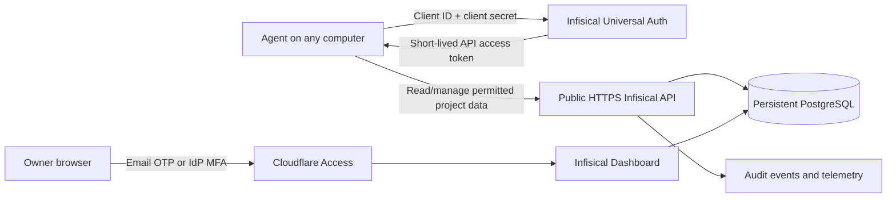

# Architecture and access model

## Components

- **Infisical**: OSS secret store, web dashboard, API, machine identities, and audit interface.
- **Public HTTPS endpoint**: Lets owner and agents reach the service from any computer. The endpoint is internet-reachable; the dashboard still requires authentication.
- **Cloudflare Access**: Protects the browser-facing dashboard with an allowlisted email one-time PIN or an identity provider with MFA. Keep API clients on Infisical's own machine-identity authentication path.
- **PostgreSQL**: Persistent backing store for Infisical. It must be backed up and restored together with the encryption and auth configuration.
- **Agent identities**: One persistent machine identity per agent/workstation. It authenticates through Universal Auth and receives an API access token with a configured TTL.

## Request flow

## Credential types

| Credential | Where it lives | Purpose | Rotation |
| --- | --- | --- | --- |
| Infisical machine-identity client secret | Local OS/agent credential store for that agent | Persistent agent login; exchange it for API access tokens | Rotate per identity; update only that agent's local credential store |
| Infisical API access token | Agent process memory/cache | Authenticated API calls | Expires/renews according to Universal Auth configuration |
| Provider API key (e.g. Vast.ai) | Infisical secret store | Provider access for the task | Rotate at the provider, then update Infisical |
| Placeholder string (e.g. `__VAST_API_KEY__`) | Agent configuration or process env | Tells compatible proxy/integration which secret to substitute | Not a secret; changing it does not revoke the provider key |
| Cloudflare tunnel/access credentials | Deployment host secret store | Route the public hostname and protect the browser UI | Rotate through Cloudflare when compromised or per its own policy |

## Access roles

The user requested persistent agent management access, including APIs, dashboard administration, and telemetry from anywhere. Each agent therefore needs its own named machine identity with the management permissions it actually uses. The owner account remains the recovery path and uses 2FA for interactive dashboard login.

If an agent needs full project-admin permissions, treat its persistent machine-identity secret as an admin password: it can change the store's access and secrets. Revoking that identity must be an available, documented operation. Do not put its client secret in GitHub, task transcripts, or a shared `.env`.

## Public does not mean anonymous

The app hostname is public so agents on multiple networks can reach it. Dashboard authentication and Infisical API authentication remain enabled. Never expose PostgreSQL or Redis as public services. Use HTTPS at the public edge and persistent storage for PostgreSQL.
